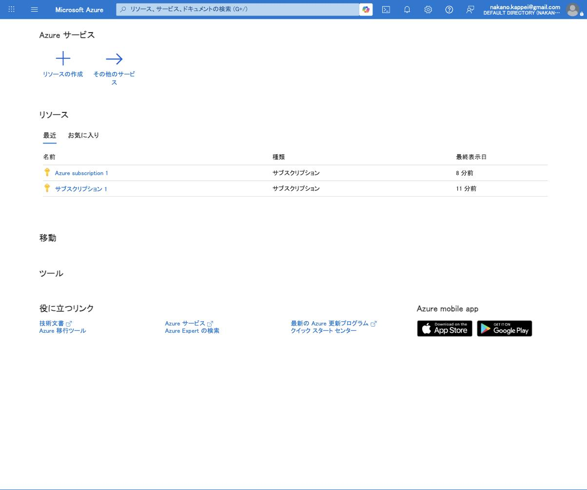
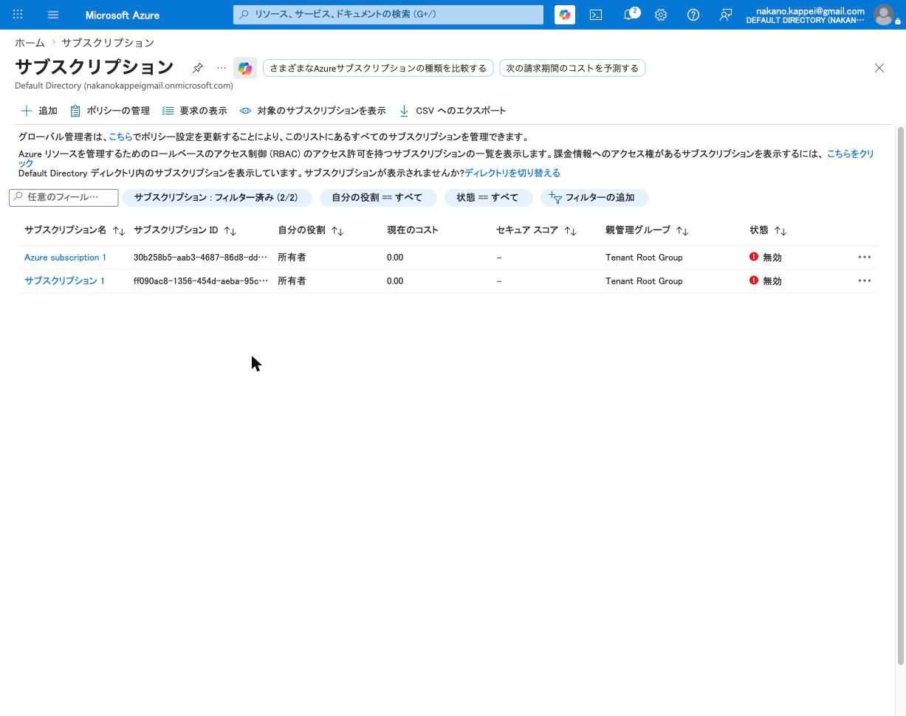
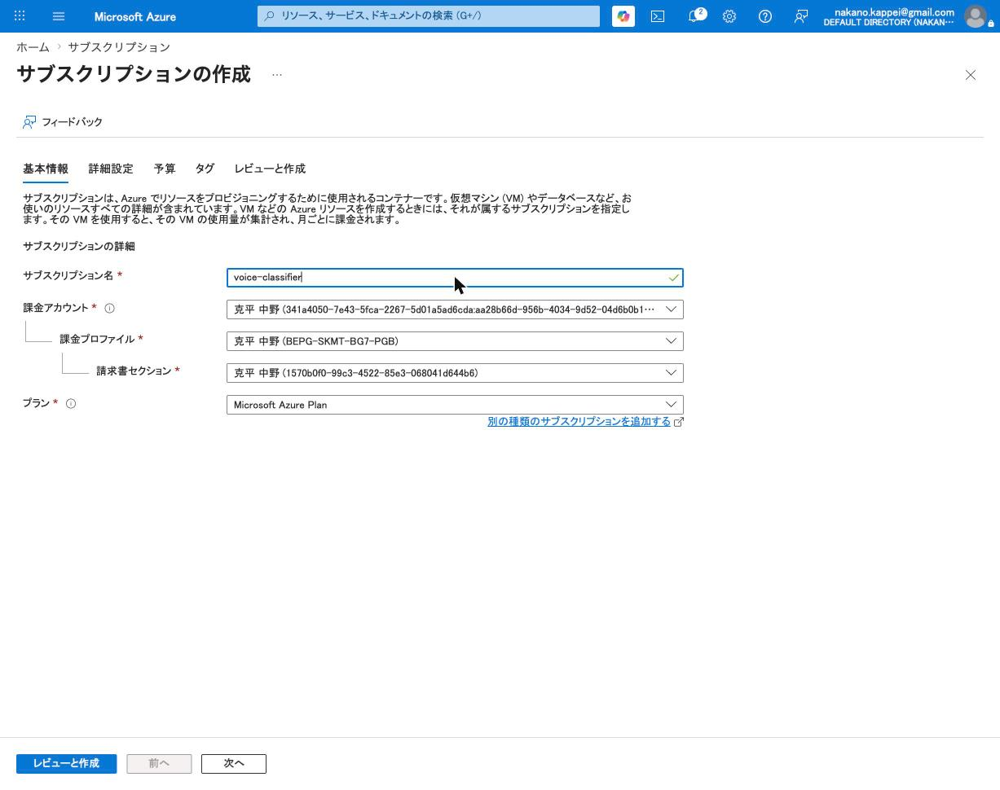
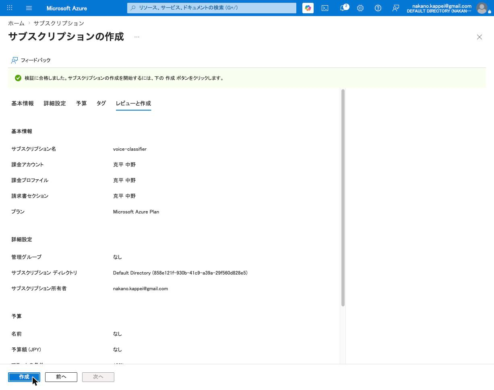
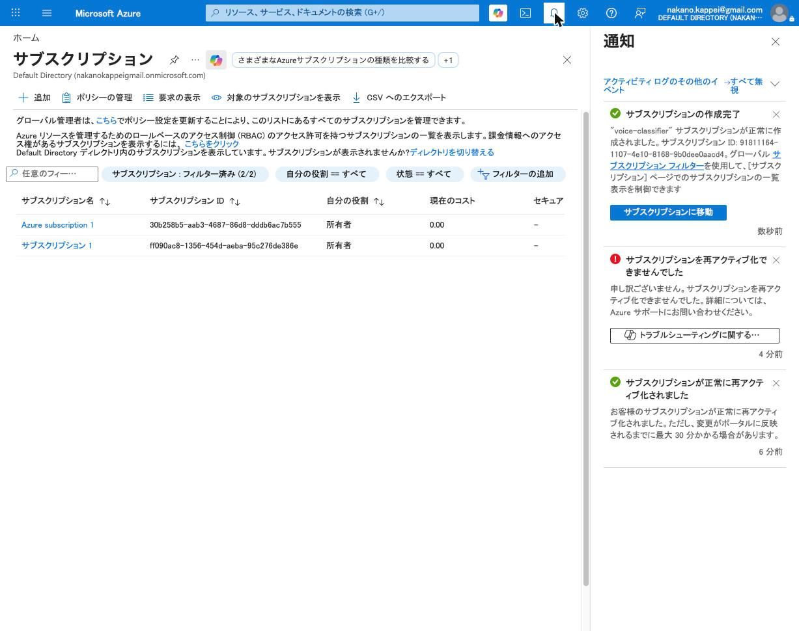

# Azure OpenAI セットアップ・マニュアル（voice-classifier 用）

> このマニュアルは、Azure ポータルを**ゼロから**操作して voice-classifier が必要とする
> Azure OpenAI 環境（サブスクリプション → リソース → モデルデプロイ → `.env` 設定 → 動作確認）
> を構築する手順をまとめたものです。2026-06-07 に実際に行った操作・画面に基づきます。
>
> **機微情報について**: 本書にはサブスクリプション ID・リソース名・エンドポイントなど
> 実値が含まれます。共有前に必要に応じてマスキングしてください。**API キーは本書には
> 記載していません**（`.env` のみに保存します）。
>
> **スクリーンショットの差し込み**: 各ステップに `` の
> 形でプレースホルダを置いています。`docs/images/azure-setup/` に対応する画像を保存すると
> 表示されます。

---

## 0. 用語の整理（最初に読む）

Azure OpenAI まわりは「場所」が 2 つあって混乱しやすいので先に整理します。

| 場所 | 役割 | ここで得るもの |
|---|---|---|
| **Azure ポータル**（portal.azure.com） | 課金単位の**サブスクリプション**と**リソース**を作る | `AZURE_OPENAI_API_KEY` / `AZURE_OPENAI_ENDPOINT` |
| **Microsoft Foundry ポータル**（ai.azure.com） | リソースに**モデルをデプロイ**し、テストする | 各デプロイメント名（3 ステージ分） |

> Foundry は「Azure AI Studio」「Azure AI Foundry」を経て改名されたもので、
> 旧「Azure OpenAI Service」は現在「Azure OpenAI in Foundry Models」という位置づけです。
> voice-classifier では Foundry を「モデルをデプロイする管理画面」として通過するだけです。

voice-classifier が `.env` で必要とする値（最終ゴール）:

```dotenv
AZURE_OPENAI_API_KEY=<リソースのキー>
AZURE_OPENAI_ENDPOINT=https://<resource>.openai.azure.com
AZURE_OPENAI_EMBEDDING_DEPLOYMENT=<埋め込みのデプロイメント名>
AZURE_OPENAI_NAMER_DEPLOYMENT=<ラベル生成用チャットのデプロイメント名>
AZURE_OPENAI_ADVISOR_DEPLOYMENT=<助言用チャットのデプロイメント名>
```

---

## 1. 前提条件

- Azure アカウント（Microsoft アカウント）でサインインできること。
- **課金が有効なサブスクリプション、または課金アカウント（課金プロファイル）が登録済み**であること。
  - 既に一度でも Azure を使っていれば、課金プロファイル（例: `Microsoft Azure Plan`）が
    登録済みのことが多く、その場合は**新規サブスクリプション作成時にカード再入力は不要**です。
- ブラウザ（本手順は Chrome を使用）。
- **Python 3.10 以上**（コードを実行する端末に必要）。
- 分類対象の **入力 CSV**。⚠️ `data/input/` は PII 保護のため **gitignored** で、
  **GitHub のクローンには含まれません**。クローン後に `data/input/` へ CSV を配置するか、
  自前の CSV を使ってください（サンプル `customer_support_tickets.csv` 等が必要な場合は
  元の担当者から別途受け取る）。同様に `.env`・`cache/`・`data/output/` も gitignored です。

> **コスト感**: voice-classifier の検証は少額です。1 万行で埋め込み ≈ $0.01、
> ラベル生成 ≈ $0.05 程度。リソースやデプロイの作成自体に固定費はかからず、
> 課金は実際に使ったトークン量だけです。

> 🖥️ **実行コマンドの読み替え（Windows / macOS・Linux）**
> 「8. 動作確認」以降のコマンドは OS により一部異なります。本書は次の規約で記載します。
> - **Python 実行**: 本書では `python` と書きます。**macOS / Linux では `python3`** に
>   読み替えてください（Windows は `python` または `py` のままで可）。
> - **仮想環境の有効化**:
>   - Windows（PowerShell）: `. .venv\Scripts\Activate.ps1`
>   - Windows（コマンドプロンプト）: `.venv\Scripts\activate.bat`
>   - macOS / Linux: `source .venv/bin/activate`
> - **`hdbscan` が Windows でインストールに失敗する場合**: `pip install hdbscan --only-binary=:all:`
> - パス区切りは、Python の引数内では `/`（スラッシュ）でも Windows で動作します。

---

## 2. サブスクリプションを新規作成する

> 既存の有効なサブスクリプションをそのまま使う場合は、この章を飛ばして「3. リソースを作成する」へ。

### 2-1. サブスクリプション一覧を開く

Azure ポータル（portal.azure.com）にサインイン →
上部検索またはメニューから **「サブスクリプション」** を開きます。





### 2-2. 「+ 追加」で作成フォームを開く

一覧上部の **「+ 追加」** をクリックします。

### 2-3. 基本情報を入力

| 項目 | 設定値（例） | 備考 |
|---|---|---|
| サブスクリプション名 | `voice-classifier` | 既存と被らない名前にする |
| 課金アカウント | （登録済みのものを選択） | 例: 個人名の課金アカウント |
| 課金プロファイル | （登録済みのものを選択） | 例: `Microsoft Azure Plan` |
| 請求書セクション | （自動選択） | |
| プラン | `Microsoft Azure Plan` | |



> 課金プロファイルが既に表示されていれば、**新たなクレジットカード入力や契約同意のステップは
> 発生しません**（既存の Microsoft Azure Plan に紐づくため）。

### 2-4. レビューと作成 → 作成

**「レビューと作成」** で検証に合格したら **「作成」** をクリック。
数十秒で完了通知が出ます（サブスクリプション ID が払い出されます）。





> **実例**: 名前 `voice-classifier` / サブスクリプション ID
> `91811164-1107-4e10-8168-9b0dee0aacd4`

> ⚠️ **伝播待ち**: 作成直後はリソース作成画面のサブスクリプション一覧にまだ出ないことがあります。
> その場合は数分待ち、ブラウザを**実際に再読み込み（Cmd+R / F5）**してから選び直してください。

---

## 3. Azure OpenAI リソースを作成する

### 3-1. リソース作成フローを開く

ポータル左上 **「リソースの作成」** → 検索ボックスに `azure openai service` と入力 →
候補から **「azure openai service」** を選択 →
Marketplace 一覧の **「Azure OpenAI」（発行元: Microsoft）** の **「作成」** をクリック。


### 3-2. 基本情報タブを入力

| 項目 | 設定値（例） | 備考 |
|---|---|---|
| サブスクリプション | `voice-classifier` | **既定で別サブスクが選ばれていることがあるので確認** |
| リソース グループ | `voice-classifier-rg` | 「新規作成」リンクから作成 |
| リージョン | `Japan East` | ※モデルの利用可否に影響（後述の注意を必読） |
| 名前 | `vc20260607` | **エンドポイントのサブドメインになる**。世界で一意・小文字英数字 |
| 価格レベル | `Standard S0` | |


> **名前 = エンドポイント**: ここで付けた名前がそのまま
> `https://<名前>.openai.azure.com` になります。例 `vc20260607` →
> `https://vc20260607.openai.azure.com`。

> **リージョン選びの注意**: リージョンによって使えるモデルが異なります。
> 特に新しいチャットモデルは地域内（regional）デプロイのクォータが無いことがあります
> （→「5. モデルをデプロイする」と「付録 A」を参照）。

### 3-3. ネットワーク／タグ

- **ネットワーク**: 既定の **「インターネットを含むすべてのネットワークがアクセスできます」** で
  OK（ワークステーションから API キーで接続するため）。
- **タグ**: 任意（未設定で可）。


### 3-4. レビューおよび送信 → 作成

検証合格後、**「作成」** をクリック。デプロイが進行し、数十秒〜1 分で
**「デプロイが完了しました」** になります。**「リソースに移動」** で次へ。


### 3-5. リソース概要を確認

`vc20260607` の概要ページで **状態: アクティブ** / **場所: Japan East** を確認。
ここに「エンドポイントを表示」「キーを管理」「Foundry ポータルに移動」があります。


---

## 4. Foundry ポータルへ移動する

リソース概要の上部 **「Foundry ポータルに移動」** をクリック →
新しいタブで Foundry（ai.azure.com）が開きます。

トップに **「エンドポイントとキー」** が表示されます。

- **Azure OpenAI エンドポイント**: `https://vc20260607.openai.azure.com/`
- **API キー**: 伏字表示（コピー/表示アイコンあり）


---

## 5. モデルをデプロイする（最重要・つまずきポイントあり）

voice-classifier は **3 ステージ**それぞれにデプロイが必要です。
今回の構成では **2 つのデプロイ**で対応しました（チャットは namer/advisor 兼用）。

| 用途 | モデル | デプロイメント名 |
|---|---|---|
| 埋め込み | `text-embedding-3-small` | `text-embedding-3-small` |
| ラベル生成（namer）＋ 助言（advisor） | `gpt-4o` | `gpt-4o` |

### 5-1. デプロイ画面を開く

Foundry 左メニュー **共有リソース → 「デプロイ」** →
**「+ モデルのデプロイ」→「基本モデルをデプロイする」**。


### 5-2. 埋め込みモデルをデプロイ（`text-embedding-3-small`）

1. 検索に `text-embedding-3-small` → 該当モデルを選択 → **「確認」**。
2. デプロイ設定ダイアログが開く。**ここで「デプロイの種類」に注意**。

> ⚠️ **つまずき①: グローバル標準だと別リージョンに別リソースを作ろうとする**
> 既定が **「グローバル標準」** だと、AI リソース欄が
> `(作成) ...-eastus2` のように**新しい別リソースを East US 2 に作る**設定になります。
> これだと `vc20260607` とは別のエンドポイント・キーになってしまいます。

3. **「カスタマイズ」** を開き、**「デプロイの種類」を「Standard」（地域内）** に変更します。
   すると **AI リソースが `vc20260607`** になり、ボタンが **「デプロイ」** に変わります
   （= 既存の Japan East リソースに載る）。


4. デプロイ名は `text-embedding-3-small`（モデル名と同じで分かりやすい）のまま **「デプロイ」**。

> ✅ 確認ポイント: デプロイ詳細の **AI リソース = `vc20260607`**、
> **リソースの場所 = Japan East**、ボタンが **「デプロイ」**（「リソースを作成して…」ではない）。

### 5-3. チャットモデルをデプロイ（`gpt-4o`）

> ⚠️ **つまずき②: Japan East はチャットモデルのクォータが限られる**
> 今回の新規サブスクリプションでは、`gpt-4o-mini` と `gpt-5.4-nano` は
> **Japan East のクォータが 0**（「クォータなし」表示／容量スライダー最大 0）でした。
> 一方、**`gpt-4o`（本体）は Japan East に 50K TPM のクォータあり**で
> `vc20260607` に直接デプロイできました。

1. 再び **「+ モデルのデプロイ」→「基本モデルをデプロイする」** → 検索 `gpt-4o` →
   **`gpt-4o`（chat-completion, responses）** を選択 → **「確認」**。
2. デプロイ設定で **「デプロイの種類」=「Standard」** を選ぶと、
   **AI リソース = `vc20260607` / リソースの場所 = Japan East / 容量 = 50K TPM** になります。
3. デプロイ名 `gpt-4o` のまま **「デプロイ」**。プロビジョニング状態が **成功** になれば完了。


> **モデル選びの指針（このプロジェクト）**
> - 埋め込み: `text-embedding-3-small`（安価・1536 次元）。
> - チャット: 本来は namer に安価モデル（`gpt-4o-mini` 等）、advisor に強めモデルを推奨。
>   ただし Japan East ではクォータの都合で **`gpt-4o` 1 つを namer/advisor 兼用**にしました。
>   `gpt-4o` は助言の「強めモデル」要件を満たし、短いラベル生成にも十分です。
> - 安価な `gpt-4o-mini` を namer に使いたい場合は **付録 A（クォータ申請）** を参照。

---

## 6. エンドポイントとキーを取得する

次のいずれかから取得できます。

- **Azure ポータル**: リソース `vc20260607` →「リソース管理」→「キーとエンドポイント」→ **KEY1** とエンドポイント。
- **Foundry ポータル**: 概要の「エンドポイントとキー」、または各デプロイ詳細の「キー」「ターゲット URI」。

| 値 | 内容 |
|---|---|
| エンドポイント | `https://vc20260607.openai.azure.com` |
| API キー | KEY1（伏字。コピーアイコンでクリップボードへ） |

> 🔑 **キーの扱い**: キーはチャットやドキュメントに貼らず、`.env` だけに保存します。
> クリップボードにコピーしておくと次章の貼り付けが楽です。

---

## 7. `.env` を設定する

まず雛形 `.env.example` をコピーして `.env` を作成します。

- **Windows（PowerShell）**: `Copy-Item .env.example .env`
- **Windows（コマンドプロンプト）**: `copy .env.example .env`
- **macOS / Linux**: `cp .env.example .env`

作成した `.env`（gitignored）を以下のように編集します。

```dotenv
# Azure OpenAI credentials (required)
AZURE_OPENAI_API_KEY=<KEY1 をここに貼り付け>
AZURE_OPENAI_ENDPOINT=https://vc20260607.openai.azure.com

# Deployment names (resource: vc20260607, region: Japan East)
AZURE_OPENAI_EMBEDDING_DEPLOYMENT=text-embedding-3-small
AZURE_OPENAI_NAMER_DEPLOYMENT=gpt-4o
AZURE_OPENAI_ADVISOR_DEPLOYMENT=gpt-4o

# Optional overrides
# AZURE_OPENAI_API_VERSION=2024-10-21
# AZURE_OPENAI_REQUEST_TIMEOUT=60
# AZURE_OPENAI_NAMER_MODEL_FAMILY=
```

> 💡 `AZURE_OPENAI_*_DEPLOYMENT` には**モデル名ではなくデプロイメント名**（5 章で付けた名前）を入れます。
> 今回は分かりやすさ優先でモデル名と同じにしているため、結果的に同じ文字列になっています。

---

## 8. 動作確認（スモークテスト）

> 以降のコマンドの `python` と仮想環境の有効化は、OS により読み替えてください
> （「1. 前提条件」の「実行コマンドの読み替え」を参照）。

### 8-1. 依存関係

```bash
python -m venv .venv
# 有効化（OS 別）:
#   Windows(PowerShell): . .venv\Scripts\Activate.ps1
#   Windows(cmd):        .venv\Scripts\activate.bat
#   macOS / Linux:       source .venv/bin/activate
pip install -r requirements.txt
```

> Windows で `hdbscan` のインストールに失敗する場合は `pip install hdbscan --only-binary=:all:`。

### 8-2. 疎通テスト（埋め込みのみ・LLM 呼び出しなし）

まず小さな部分集合（先頭 40 行）を作ります。**コマンドは OS 別**です。

- **Windows（PowerShell）**:
  ```powershell
  Get-Content data\input\customer_support_tickets.csv -TotalCount 41 | Set-Content data\input\smoke_test.csv
  ```
- **macOS / Linux**:
  ```bash
  head -n 41 data/input/customer_support_tickets.csv > data/input/smoke_test.csv
  ```

> うまく作れない場合は、テキストエディタで先頭 40 行程度を残した CSV を手動保存しても構いません。

作成したサンプルで実行します（1 行で実行）。

```bash
python src/pipeline.py --input data/input/smoke_test.csv --text-col "Ticket Description" --no-name-clusters --no-advise
```

> ⚠️ **キャッシュ名の落とし穴**: 埋め込みキャッシュは**デプロイメント名でキー付け**されます
> （`cache/embeddings_<deployment>.pkl`）。デプロイ名を `text-embedding-3-small` にすると、
> 過去に同名で作られたキャッシュに当たり「All N items served from cache」と表示され、
> **Azure を呼ばない**ことがあります。実際に Azure を叩いて検証したいときは
> 新しいキャッシュディレクトリを指定します:
>
> ```bash
> python src/pipeline.py --input data/input/smoke_test.csv --text-col "Ticket Description" --no-name-clusters --no-advise --cache-dir cache_aztest
> ```
>
> ログに **`Fetching embeddings: N from API (cache hits: 0)`** と出れば Azure 接続成功です。

### 8-3. フル実行（埋め込み ＋ gpt-4o ラベル生成 ＋ 助言）

```bash
python src/pipeline.py --input data/input/smoke_test.csv --text-col "Ticket Description" --cache-dir cache_aztest
```

成功例（要約）:
- データ文脈推定（gpt-4o）: `domain=Consumer electronics customer support inquiries`
- ラベル生成（gpt-4o, 8 件 API）: `#0 Power failure / #1 Troubleshooting steps / #2 Battery performance`
- 助言ノート（gpt-4o, 約 2200 文字）
- レポート出力 → `data/output/YYYYMMDD_HHMMSS/`

### 8-4. 本番（全件）

```bash
# 英語チケット（約 3 万行）
python src/pipeline.py --input data/input/customer_support_tickets.csv --text-col "Ticket Description"

# 日本語の修理データ（約 2.5 万行）
python src/pipeline.py --input data/input/repair_full.csv --text-col "修理依頼内容"
```

---

## 付録 A. チャットモデルのクォータを増やす（Japan East で gpt-4o-mini 等を使いたい場合）

Japan East で `gpt-4o-mini` 等のクォータが 0 の場合、次のいずれか。

1. **クォータ申請**: Foundry 左メニュー **「クォータ」**、または各デプロイ画面の
   **「クォータの要求」** から、対象モデル × Japan East の TPM 増枠を申請する。
   （承認に時間がかかる場合あり）
2. **別リージョンを使う**: East US 2 などクォータがあるリージョンに**別リソース**を作る方法。
   ただし**エンドポイントとキーがリソースごとに別**になります。voice-classifier は
   `AZURE_OPENAI_ENDPOINT` を 1 つだけ持つ単一エンドポイント構成なので、
   埋め込みとチャットを別リソースに分けると**そのままでは動きません**（コード改修が必要）。
   → 当面は **全モデルを 1 リソースに集約できるリージョン**を選ぶのが無難です。

---

## 付録 B. デプロイの種類（用語）

| 種類 | 概要 | このプロジェクトでの扱い |
|---|---|---|
| **Standard**（地域内） | 指定リージョンのリソースで処理。データ所在地が明確 | **採用**。`vc20260607`（Japan East）に載る |
| グローバル標準 | 世界規模で処理。最も高いレート上限 | Japan East 既存リソースに載らない／別リソース作成になることがある |
| データ ゾーン標準 | データゾーン内で処理 | 今回はクォータ不足 |
| 各種バッチ／プロビジョニング済みスループット | 大規模・専有向け | 今回は不使用 |

---

## 付録 C. よくあるつまずきと対処

| 症状 | 原因 | 対処 |
|---|---|---|
| 新規サブスクがリソース作成画面の一覧に出ない | 作成直後の伝播待ち | 数分待って**ブラウザを実際に再読み込み**（Cmd+R）して検索し直す |
| デプロイが East US 2 に別リソースを作ろうとする | デプロイの種類が「グローバル標準」 | 「カスタマイズ」→「Standard」に変更（既存リソースに載る） |
| 容量スライダーが 0 のまま動かない／「クォータなし」 | そのモデル×リージョンのクォータが 0 | 別モデル（例 `gpt-4o`）にするか、付録 A のクォータ申請 |
| `Fetching` が出ず「served from cache」になる | デプロイ名がキャッシュ名と衝突 | `--cache-dir` を新規に指定、または `cache/` をクリア |
| `AZURE_OPENAI_API_KEY is not set` 等 | `.env` 未設定／実行ディレクトリ違い | `.env` を確認し、プロジェクト直下から実行 |

---

## 付録 D. 今回の実構成（参考値）

| 項目 | 値 |
|---|---|
| サブスクリプション名 | `voice-classifier` |
| サブスクリプション ID | `91811164-1107-4e10-8168-9b0dee0aacd4` |
| リソースグループ | `voice-classifier-rg` |
| Azure OpenAI リソース | `vc20260607` |
| リージョン | Japan East |
| エンドポイント | `https://vc20260607.openai.azure.com` |
| 埋め込みデプロイ | `text-embedding-3-small` |
| チャットデプロイ（namer/advisor 兼用） | `gpt-4o`（Standard, 50K TPM） |
